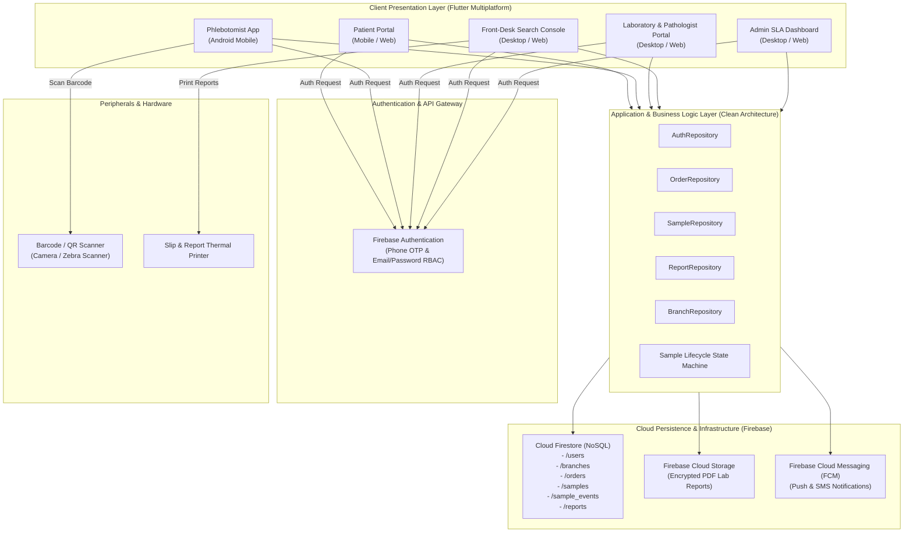
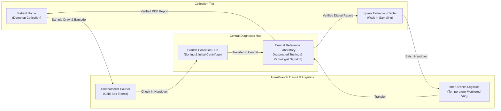
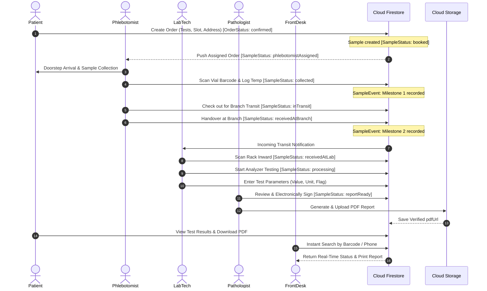

# High-Level Design (HLD)
# SW2627: Diagnostic Lab Management (LabTrack)

## 1. Document Control & Metadata

| Field | Value |
|---|---|
| **System Name** | LabTrack (Diagnostic Lab Management System) |
| **Project Code** | SW2627 |
| **Document Version** | 2.0.0 |
| **Status** | Approved Architectural Specification |
| **Architectural Style** | Clean Architecture / Event-Driven Reactive Mobile & Web |
| **Primary Cloud Infrastructure** | Google Firebase (Auth, Cloud Firestore, Cloud Storage, FCM) |
| **Frontend Framework** | Flutter 3.x (Multiplatform: Android, iOS, Web) |

---

## 2. Architecture Goal & Principles

The High-Level Design establishes the macro-architectural structure for **LabTrack**, addressing the operational breakdown between field phlebotomists, multi-branch transit networks, testing laboratories, and front-desk customer service desks.

### Core Architectural Principles
1. **Clean Architecture Separation**: Strict boundaries between Presentation, Domain (Business Rules & Entities), and Data (Repositories, Firebase SDK, Hardware Camera) layers.
2. **Event-Sourced Chain of Custody**: Rather than merely mutating a status field, every custody handoff or state change creates an immutable event record (`SampleEventModel`).
3. **Offline-First Resilience**: Mobile clients used by field phlebotomists must function under intermittent 3G/4G connectivity, caching scans locally and synchronizing seamlessly upon reconnection.
4. **Real-Time Reactive State**: Utilizing Cloud Firestore snapshot streams so that front-desk personnel and patients receive live operational updates without manual screen refreshing.
5. **Zero-Trust Role-Based Access Control (RBAC)**: All database reads, writes, and cloud assets are gated at the database engine level via Firestore Security Rules, verifying token claims.

---

## 3. High-Level System Architecture Diagram

---

## 4. Multi-Branch Diagnostic Network Topology (Hub-and-Spoke)

Diagnostic testing in LabTrack operates across a distributed multi-branch topology:

### Topology Routing Logic
1. **Tier 1 (Home Collection)**: The phlebotomist draws blood into specialized vacuum containers (e.g., EDTA Purple, SST Gold), tags each vial with a pre-printed barcode, and logs the milestone into the mobile app.
2. **Tier 2 (Branch Collection Hub)**: The phlebotomist delivers sample batches to the nearest local branch. Hub staff scan incoming vials to confirm receipt, separating routine tests from specialized esoteric tests.
3. **Tier 3 (Central Reference Lab)**: Specialized or high-volume panels are transferred via refrigerated courier to the Central Reference Lab, where laboratory accessioning, processing, parameter analysis, and pathologist verification occur.

---

## 5. Architectural Subsystems

### 5.1 Presentation Subsystem (Flutter Single-Codebase)
- Built as a unified Flutter codebase targeting Android, iOS, and Web.
- Employs dynamic role-gated navigation: upon authentication, the user's role (`UserRole`) dictates the accessible navigation stack.
- Dedicated UI modules:
  - `features/patient`: Home booking, interactive test catalog, visual status timeline, report viewer.
  - `features/phlebotomist`: Pickup queue, home navigation, barcode camera scanner, collection confirmation.
  - `features/lab`: Batch rack scanning, accessioning, test parameter entry form, specimen rejection handler.
  - `features/frontdesk`: High-performance instant search bar (order ID/phone/barcode), slip-less report lookup, print spooler.
  - `features/admin`: Branch management, staff allocation, SLA compliance dashboard.

### 5.2 Barcode & Identification Subsystem
- Uses standard Code128 / QR alphanumeric symbology for diagnostic sample identification.
- Eliminates manual handwriting mistakes by pairing physical pre-barcoded tubes to the digital `SampleModel` in one camera scan.
- Allows front desk and lab technicians to execute zero-keystroke accessioning using either smartphone cameras or hardware USB/Bluetooth 2D barcode imagers.

### 5.3 Chain-of-Custody & Cold-Chain Telemetry Subsystem
- Enforces an append-only architecture: modifying a sample's status writes an entry into the `/sample_events` subcollection.
- Milestones record custodian metadata, GPS coordinates, location string, timestamp, and temperature reading (°C).
- If the logged temperature exceeds acceptable thresholds (e.g., > 8°C for cold-chain whole blood), the system flags a cold-chain warning.

### 5.4 Diagnostic Result Entry & Verification Engine
- Lab technicians input test findings matching discrete analytical parameters (`ReportParameter`).
- The engine automatically compares numeric values against sex- and age-specific biological reference intervals, tagging parameters with:
  - `Normal`: Within standard clinical range.
  - `High` / `Low`: Out-of-range parameters requiring physician review.
  - `Critical`: Severe panic values requiring immediate notification.
- Digital sign-off: Pathologists review entered values and digitally authorize the report, locking the document against subsequent alterations.

### 5.5 Front-Desk Instant Search Subsystem
- Designed to replace physical paper tracking slips.
- Indexes active orders and samples by:
  - Patient Phone Number (`patientPhone`)
  - Order Identifier (`orderId`)
  - Vial Barcode (`barcode`)
  - Patient Full Name (`patientName`)
- Queries execute directly against optimized Firestore indexes, delivering sub-second search results even under high concurrency.

---

## 6. End-to-End System Sequence Diagram

---

## 7. Data Architecture & Storage Strategy

### 7.1 Cloud Firestore Collections
The database is structured into six top-level NoSQL collections:
1. `users`: Stores user profiles, authentication metadata, and role assignments (`patient`, `phlebotomist`, `labTechnician`, `frontDesk`, `admin`).
2. `branches`: Multi-branch network metadata (Hubs, Collection Centers, Central Lab, coordinates, contact info).
3. `orders`: High-level patient bookings, scheduled slots, payment status, list of sample barcodes.
4. `samples`: Granular vial entities with barcode primary key, order reference, current status, and vial type.
5. `sample_events`: Immutable audit trail documenting every custody milestone.
6. `reports`: Pathologist-verified diagnostic reports, parameter lists, abnormal flags, and PDF links.

### 7.2 Firebase Cloud Storage
- Stores compiled, print-ready PDF reports (`/reports/{orderId}/{sampleBarcode}.pdf`).
- Encrypted at rest using AES-256 server-side encryption.
- Read access gated through Firebase Storage Security Rules ensuring only authorized patients, attending clinicians, front desk, and admins can download documents.

---

## 8. Security, Privacy & Compliance Architecture

1. **Healthcare Data Privacy (HIPAA / DISHA)**:
   - Patient health information (PHI) and clinical results are strictly partitioned.
   - Audit logging ensures every view and download of diagnostic reports is registered with the requesting user ID.
2. **Transport & Data Security**:
   - All client-to-cloud network traffic is secured using TLS 1.3.
   - Firebase offline cache databases on mobile devices utilize platform-native AES encrypted storage.
3. **Role-Based Granular Access Rules**:
   - Patients can only read their own orders and reports (`request.auth.uid == resource.data.patientId`).
   - Phlebotomists can only update samples assigned to them.
   - Lab Technicians can write parameter data; only Pathologists/Admins can mark reports as verified (`reportReady`).
   - Front Desk has read-only access to search and view reports across all branches.

---

## 9. Deployment & Containerization Architecture

- **Mobile Client**: Compiled to native Android ARM64/x86_64 APK/AAB and iOS IPA.
- **Web / Desktop Console**:
  - The repository includes a production [`Dockerfile`](file:///a:/Projects/SW2627-Diagnostic-Lab-Management/Dockerfile) and [`docker-compose.yml`](file:///a:/Projects/SW2627-Diagnostic-Lab-Management/docker-compose.yml) for containerized web hosting.
  - Nginx web server serves the Flutter Web build bundle with HTTP/2 and gzip/brotli compression enabled.
  - Healthcheck probes verify container availability on port 80.