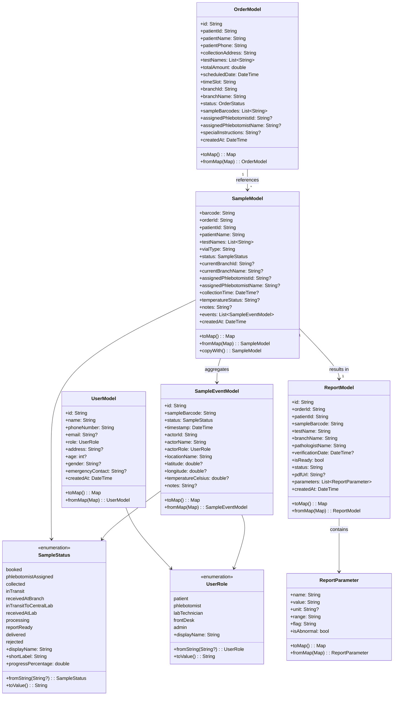

# Low-Level Design (LLD)
# SW2627: Diagnostic Lab Management (LabTrack)

## 1. Document Control & Metadata

| Field | Value |
|---|---|
| **System Name** | LabTrack (Diagnostic Lab Management System) |
| **Project Code** | SW2627 |
| **Document Version** | 2.0.0 |
| **Status** | Approved Low-Level Design Specification |
| **Scope** | Schemas, Class Diagrams, State Machine, Repository Interfaces, Security Rules |
| **Implementation Language** | Dart / Flutter 3.x |
| **Database** | Cloud Firestore (NoSQL Document Store) |

---

## 2. Cloud Firestore Database Schema & Data Models

### 2.1 Collection: `/users`
Stores user identity, role assignments, and personal contact information.

```json
{
  "id": "USR-98124",                  // String (Document ID / Firebase Auth UID)
  "name": "Dr. Rajesh Sharma",        // String
  "phoneNumber": "+91 98765 43210",   // String (E.164 format)
  "email": "rajesh.sharma@lab.com",   // String
  "role": "labTechnician",            // String: 'patient' | 'phlebotomist' | 'labTechnician' | 'frontDesk' | 'admin'
  "address": "42 Green Glen, Sec 2",  // String?
  "age": 34,                          // Number?
  "gender": "Male",                   // String?
  "emergencyContact": "+91 98765 00", // String?
  "branchId": "BR-BLR-01",            // String? (Associated Branch ID for staff)
  "createdAt": "2026-09-15T09:30:00Z" // String (ISO-8601 Timestamp)
}
```

### 2.2 Collection: `/branches`
Stores geographic facilities, collection centers, and central laboratory hubs.

```json
{
  "id": "BR-BLR-01",                  // String (Document ID)
  "name": "Bengaluru Central Lab",    // String
  "address": "Plot 12, Indiranagar",  // String
  "contactNumber": "+91 80 44556677", // String
  "isCentralLab": true,               // Boolean (Can verify and process reports)
  "isActive": true,                   // Boolean
  "createdAt": "2026-01-01T00:00:00Z" // String (ISO-8601 Timestamp)
}
```

### 2.3 Collection: `/orders`
Represents diagnostic test bookings created by patients or front-desk staff.

```json
{
  "id": "ORD-2026-1049",                    // String (Document ID)
  "patientId": "USR-98124",                 // String (Foreign Key -> /users)
  "patientName": "Aarav Patel",             // String (Denormalized for quick search)
  "patientPhone": "+91 98111 22233",        // String (Denormalized for fast front-desk lookup)
  "collectionAddress": "Villa 14, Palm Gr", // String
  "testNames": ["CBC", "Lipid Profile"],    // Array<String>
  "totalAmount": 1000.0,                    // Number (Total INR)
  "scheduledDate": "2026-10-06T00:00:00Z",  // String (ISO-8601)
  "timeSlot": "07:00 AM - 08:00 AM",        // String
  "branchId": "BR-BLR-01",                  // String (Foreign Key -> /branches)
  "branchName": "Bengaluru Central Lab",    // String
  "status": "confirmed",                    // String: 'pending' | 'confirmed' | 'inProgress' | 'completed' | 'cancelled'
  "sampleBarcodes": ["SMP-90214", "SMP-90215"], // Array<String> (Foreign Keys -> /samples)
  "assignedPhlebotomistId": "PHL-401",      // String? (Foreign Key -> /users)
  "assignedPhlebotomistName": "Karan Nair", // String?
  "specialInstructions": "Fasting 10 hrs",  // String?
  "createdAt": "2026-10-05T08:15:00Z"       // String (ISO-8601)
}
```

### 2.4 Collection: `/samples`
Represents an individual physical collection vial (e.g., EDTA, SST tube) labeled with a unique barcode.

```json
{
  "barcode": "SMP-90214",                     // String (Document ID / Primary Key)
  "orderId": "ORD-2026-1049",                 // String (Foreign Key -> /orders)
  "patientId": "USR-98124",                   // String (Foreign Key -> /users)
  "patientName": "Aarav Patel",               // String
  "testNames": ["Complete Blood Count (CBC)"],// Array<String>
  "vialType": "Standard EDTA (Purple Top)",   // String: 'Standard EDTA' | 'Serum SST' | 'Sodium Citrate' | 'Fluoride'
  "status": "inTransit",                      // String: Enum SampleStatus (11 states)
  "currentBranchId": "BR-BLR-01",             // String?
  "currentBranchName": "Bengaluru Central",   // String?
  "assignedPhlebotomistId": "PHL-401",        // String?
  "assignedPhlebotomistName": "Karan Nair",   // String?
  "collectionTime": "2026-10-05T08:45:00Z",   // String? (ISO-8601)
  "temperatureStatus": "Normal (4°C - 8°C)",  // String? ('Normal' | 'Excursion Warning')
  "notes": "Smooth venipuncture, antecubital",// String?
  "events": [],                               // Array<Map> (Embedded cache of SampleEventModel)
  "createdAt": "2026-10-05T08:15:00Z"         // String (ISO-8601)
}
```

### 2.5 Collection: `/sample_events` (Append-Only Chain-of-Custody Ledger)
Stores every physical handoff, temperature reading, and status change as an immutable record.

```json
{
  "id": "EVT-88419",                   // String (Document ID)
  "sampleBarcode": "SMP-90214",        // String (Foreign Key -> /samples/barcode)
  "status": "collected",               // String (Target SampleStatus)
  "timestamp": "2026-10-05T08:45:00Z", // String (ISO-8601)
  "actorId": "PHL-401",                // String (Foreign Key -> /users)
  "actorName": "Karan Nair",           // String
  "actorRole": "phlebotomist",         // String: UserRole enum
  "locationName": "Patient Residence", // String
  "latitude": 12.9716,                 // Number? (GPS Latitude)
  "longitude": 77.5946,                // Number? (GPS Longitude)
  "temperatureCelsius": 5.4,           // Number? (Cold-chain vial temperature)
  "notes": "Vial barcoded and sealed"  // String?
}
```

### 2.6 Collection: `/reports`
Stores verified pathology test results, individual parameter measurements, and PDF references.

```json
{
  "id": "RPT-2026-5510",               // String (Document ID)
  "orderId": "ORD-2026-1049",          // String (Foreign Key -> /orders)
  "patientId": "USR-98124",            // String (Foreign Key -> /users)
  "sampleBarcode": "SMP-90214",        // String (Foreign Key -> /samples)
  "testName": "Complete Blood Count",  // String
  "branchName": "Central Lab",         // String
  "pathologistName": "Dr. Ananya Roy", // String
  "verificationDate": "2026-10-05T14:30:00Z", // String? (ISO-8601)
  "isReady": true,                     // Boolean
  "status": "Verified",                // String ('Processing' | 'Draft' | 'Verified')
  "pdfUrl": "https://storage.googleapis.com/labtrack-reports/RPT-2026-5510.pdf", // String?
  "parameters": [                      // Array<ReportParameter>
    {
      "name": "Hemoglobin",
      "value": "14.2",
      "unit": "g/dL",
      "range": "13.0 - 17.0",
      "flag": "Normal"
    },
    {
      "name": "Total Leucocyte Count",
      "value": "11800",
      "unit": "/cumm",
      "range": "4000 - 11000",
      "flag": "High"
    },
    {
      "name": "Platelet Count",
      "value": "2.4",
      "unit": "lakh/cumm",
      "range": "1.5 - 4.5",
      "flag": "Normal"
    }
  ],
  "createdAt": "2026-10-05T13:00:00Z"
}
```

---

## 3. Class & Domain Entities Diagram



---

## 4. State Machine & Transition Rules Matrix

The table below defines all legal transitions for [`SampleStatus`](file:///a:/Projects/SW2627-Diagnostic-Lab-Management/lab_track/lib/domain/enums/sample_status.dart#L3-L14):

| Source State | Target State | Trigger / Action | Authorized Role | Preconditions & Validation Rules | Side-Effects |
|---|---|---|---|---|---|
| `booked` | `phlebotomistAssigned` | Assign phlebotomist to order | Admin / Dispatcher | Phlebotomist must be active and available. | Order updated with `assignedPhlebotomistId`. |
| `phlebotomistAssigned` | `collected` | Scan vial barcode at doorstep | Phlebotomist | Barcode must be non-empty and unique. | Records `collectionTime`, `temperatureCelsius`, emits `SampleEventModel`. |
| `collected` | `inTransit` | Phlebotomist departs patient home | Phlebotomist | Sample must be in cold-box container. | Updates sample location. |
| `inTransit` | `receivedAtBranch` | Inward scan at Branch Hub | Branch Staff / Front Desk | Physical barcode scanned at hub. | Handoff recorded with hub `locationName`. |
| `receivedAtBranch` | `inTransitToCentralLab`| Outward dispatch to Central Lab | Hub Logistics Staff | Batched onto inter-branch transit manifest. | Event logged with courier ID. |
| `inTransitToCentralLab`| `receivedAtLab` | Rack accessioning at Central Lab| Lab Technician | Scan barcode at central accessioning bench. | Sets `currentBranchId` to Central Lab. |
| `receivedAtLab` | `processing` | Sample placed on automated analyzer| Lab Technician | Specimen inspected for hemolysis/clotting. | Notifies patient: testing in progress. |
| `processing` | `reportReady` | Pathologist verification & sign-off | Pathologist / Admin | All mandatory parameters filled; reference ranges checked. | Generates PDF, uploads to Storage, unlocks patient download. |
| `reportReady` | `delivered` | Report viewed or handed to patient | System / Front Desk | Patient downloaded PDF or received printout. | Marks order lifecycle as completed. |
| *Any Pre-Testing State* | `rejected` | Specimen clotted, hemolyzed, or lost | Lab Tech / Pathologist | Rejection reason must be specified in notes. | Automatically triggers recollection order alert to front desk/patient. |

---

## 5. Repository & Service Layer Contracts (Dart)

### 5.1 `IAuthRepository`
```dart
abstract class IAuthRepository {
  UserModel? get cachedUser;
  Future<UserModel> signInAsDemoPatient();
  Future<void> sendOtp({
    required String phoneNumber,
    required void Function(String verificationId) onCodeSent,
    required void Function(String error) onError,
    void Function(PhoneAuthCredential credential)? onAutoVerify,
  });
  Future<UserModel> verifyOtp({
    required String verificationId,
    required String smsCode,
    required String phoneNumber,
  });
  Future<UserModel> saveProfile(UserModel user);
  Future<void> signOut();
}
```

### 5.2 `ISampleRepository`
```dart
abstract class ISampleRepository {
  Stream<SampleModel?> watchSampleByBarcode(String barcode);
  Future<SampleModel?> getSampleByBarcode(String barcode);
  Future<List<SampleModel>> getSamplesByOrderId(String orderId);
  Future<void> createSample(SampleModel sample);
  Future<void> updateSampleStatus({
    required String barcode,
    required SampleStatus newStatus,
    required String actorId,
    required String actorName,
    required UserRole actorRole,
    required String locationName,
    double? latitude,
    double? longitude,
    double? temperatureCelsius,
    String? notes,
  });
  Future<void> rejectSample({
    required String barcode,
    required String rejectionReason,
    required String actorId,
    required String actorName,
  });
}
```

### 5.3 `IOrderRepository`
```dart
abstract class IOrderRepository {
  Future<String> createOrder(OrderModel order);
  Future<OrderModel?> getOrderById(String orderId);
  Stream<List<OrderModel>> watchOrdersByPatientId(String patientId);
  Stream<List<OrderModel>> watchAssignedPickups(String phlebotomistId);
  Future<List<OrderModel>> searchOrders(String query);
  Future<void> assignPhlebotomist(String orderId, String phlebotomistId, String phlebotomistName);
}
```

### 5.4 `IReportRepository`
```dart
abstract class IReportRepository {
  Future<ReportModel?> getReportBySampleBarcode(String barcode);
  Future<ReportModel?> getReportById(String reportId);
  Stream<List<ReportModel>> watchReportsByPatientId(String patientId);
  Future<void> submitReportDraft(ReportModel report);
  Future<void> verifyAndPublishReport({
    required String reportId,
    required String pathologistName,
    required String pdfUrl,
  });
  Future<String> uploadReportPdf(String reportId, List<int> pdfBytes);
}
```

---

## 6. UI & Screen Navigation Hierarchy

The application routing is organized by user role (`UserRole`) with explicit route guards:

```text
/ (App Entry)
 ├── /auth/login (Phone OTP / Demo 1-Click Login)
 │
 ├── /patient
 │    ├── /home (Active orders, test catalog shortcut, quick actions)
 │    ├── /book-collection (Select tests, choose slot, set address)
 │    ├── /track-sample/:barcode (Live percentage tracker & milestone feed)
 │    └── /my-reports (List of verified reports with PDF download)
 │
 ├── /phlebotomist
 │    ├── /home (Summary of today's pickups, route map)
 │    ├── /pickups (Pending, completed, urgent pickups)
 │    ├── /order/:orderId (Patient details, address, tests required)
 │    └── /scan-vial/:orderId (Barcode camera scanner & temperature logger)
 │
 ├── /lab
 │    ├── /home (Lab queue stats, incoming transit batches)
 │    ├── /scan-receive (Batch rack inward barcode scanning)
 │    ├── /processing/:barcode (Parameter data entry, auto-flag evaluation)
 │    └── /verify-report/:barcode (Pathologist digital sign-off)
 │
 ├── /frontdesk
 │    ├── /home (Desk overview, today's footfall, recent orders)
 │    ├── /search (Instant search by phone / barcode / order ID)
 │    ├── /order-detail/:orderId (Live status card, physical slip replacement)
 │    └── /view-report/:reportId (Print preview & thermal printer spooling)
 │
 └── /admin
      ├── /home (Operational metrics, branch status)
      ├── /branches (Manage branches & collection hubs)
      ├── /staff (Phlebotomist & lab tech allocation)
      └── /sla-dashboard (TAT trends, rejection root causes)
```

---

## 7. Cloud Firestore Security Rules (`firestore.rules`)

```javascript
rules_version = '2';
service cloud.firestore {
  match /databases/{database}/documents {

    // Helper functions
    function isAuthenticated() {
      return request.auth != null;
    }

    function getUserData() {
      return get(/databases/$(database)/documents/users/$(request.auth.uid)).data;
    }

    function hasRole(role) {
      return isAuthenticated() && getUserData().role == role;
    }

    function isStaff() {
      return hasRole('phlebotomist') || hasRole('labTechnician') || hasRole('frontDesk') || hasRole('admin');
    }

    // Users Collection
    match /users/{userId} {
      allow read: if isAuthenticated();
      allow write: if isAuthenticated() && (request.auth.uid == userId || hasRole('admin'));
    }

    // Branches Collection
    match /branches/{branchId} {
      allow read: if isAuthenticated();
      allow write: if hasRole('admin');
    }

    // Orders Collection
    match /orders/{orderId} {
      allow read: if isAuthenticated() && (
        resource.data.patientId == request.auth.uid ||
        resource.data.assignedPhlebotomistId == request.auth.uid ||
        isStaff()
      );
      allow create: if isAuthenticated();
      allow update: if isStaff();
    }

    // Samples Collection
    match /samples/{barcode} {
      allow read: if isAuthenticated() && (
        resource.data.patientId == request.auth.uid ||
        isStaff()
      );
      allow create: if isAuthenticated();
      allow update: if isStaff();
    }

    // Sample Events Collection (Append-Only)
    match /sample_events/{eventId} {
      allow read: if isAuthenticated();
      allow create: if isStaff();
      allow update, delete: if false; // Strict immutability
    }

    // Reports Collection
    match /reports/{reportId} {
      allow read: if isAuthenticated() && (
        resource.data.patientId == request.auth.uid ||
        isStaff()
      );
      allow create, update: if hasRole('labTechnician') || hasRole('admin');
    }
  }
}
```

---

## 8. Critical Edge Cases & Failure Recovery

1. **Barcode Collision or Re-scan**:
   - The system validates that each barcode is unique across active samples. If a phlebotomist scans a barcode already associated with another active sample, the UI immediately alerts the user with an audible warning and prompts for a fresh sterile tube.
2. **Cold-Chain Temperature Excursion**:
   - If the logged temperature is `< 2°C` or `> 10°C` during transit of whole-blood EDTA tubes, the system flags `temperatureStatus: 'Excursion Warning'` and notifies the receiving lab technician to inspect the specimen for hemolysis before accessioning.
3. **Specimen Rejection & Auto-Recollection Workflow**:
   - When a sample is marked `SampleStatus.rejected`, the state machine marks the sample as unusable, sets the reason in `notes`, and automatically generates an unassigned priority re-collection order linked to the original `orderId`, notifying both the patient and front desk.
4. **Offline Mobile Caching for Phlebotomists**:
   - When network connectivity is lost during home visits, the Flutter app utilizes Firestore's offline disk cache to queue sample barcodes, timestamps, and GPS coordinates locally. When internet connectivity is restored, Firestore automatically pushes all pending writes in sequential order.
